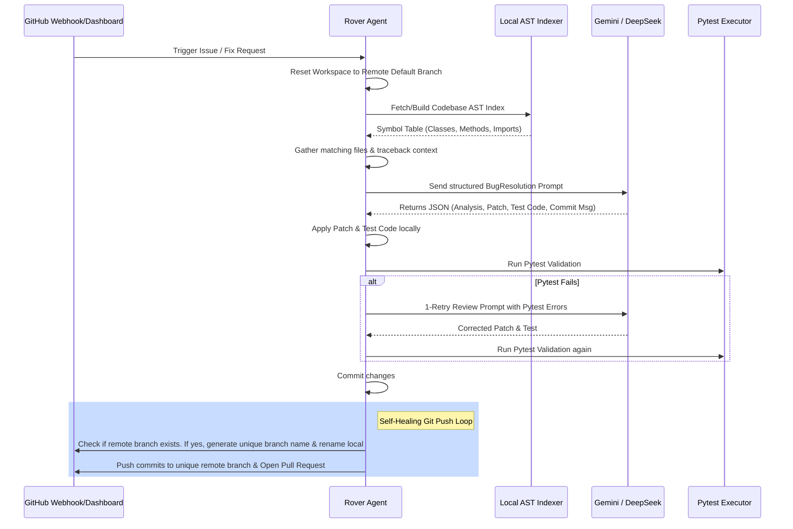

# Rover 🐕

**Autonomous Codebase Explorer, Static Analyzer & Self-Healing Bug-Fix Engine**

Rover is a production-grade autonomous software engineering agent that scans repositories, parses AST symbols, runs local verification tests, and automatically creates pull requests to fix security vulnerabilities and logical bugs.

[](https://opensource.org/licenses/MIT)
[](https://www.python.org/downloads/)
[](https://deepmind.google/technologies/gemini/)

---

## 📖 Table of Contents
1. [Overview](#-overview)
2. [Problem Statement](#-problem-statement)
3. [Key Features](#-key-features)
4. [Architecture & Workflow](#-architecture--workflow)
5. [Technology Stack](#-technology-stack)
6. [AI Models & Provider Abstraction](#-ai-models--provider-abstraction)
7. [GitHub App Authentication](#-github-app-authentication)
8. [Installation & Setup](#-installation--setup)
9. [Usage Guide](#-usage-guide)
10. [Troubleshooting & FAQ](#-troubleshooting--faq)
11. [Roadmap](#-roadmap)
12. [License](#-license)

---

## 🔍 Overview

Rover operates in two distinct operational phases:
1. **Proactive Mode (Scan & Discover)**: Crawls a codebase, runs AST static analysis rules for code vulnerabilities, utilizes LLM analysis, and renders the findings in a SaaS-style dashboard.
2. **Reactive Mode (Gather & Solve)**: Replaces high-cost "Think -> Search" loops with a deterministic "Analyze -> Gather Context -> Solve" model. It extracts context using a local symbol table, generates structured fixes, verifies them locally with pytest, and pushes PRs via a self-healing git branch conflict resolution flow.

---

## 💡 Problem Statement

Traditional agent architectures exhaust API rate-limits by repeatedly calling LLMs to search for files, write code, run tests, and refine commits. This iterative loop consumes 15–20+ LLM requests per bug. Rover resolves this by indexing codebases locally using abstract syntax trees (ASTs), parsing tracebacks deterministically, and bundling analysis, code changes, and test replication into a single structured LLM call.

---

## ✨ Key Features

* 🚀 **Deterministic Context Indexer**: Recursively builds an AST symbol table (classes, methods, functions, constants, imports, docstrings) before calling the LLM.
* 🛡️ **Proactive Static Scanner**: Custom rules for security analysis (eval injections, SQL queries, raw secrets, and resource leaks).
* 🔄 **Single-Call Structured Prompting**: Enforces Pydantic `BugResolution` schemas to return diagnosis, source edits, unit test codes, commit messages, and PR templates in one API round-trip.
* 📦 **Self-Healing Git Workflow**: Automatically generates unique branch suffixes and resolves non-fast-forward push conflicts without manual intervention.
* 🔑 **GitHub App Authentication**: Full PEM key validation, installation token refresh, and secure webhook HMAC verification.
* 📊 **Glassmorphic Streamlit Dashboard**: Tabbed runs history panel, visual HTML/CSS scan timelines, and interactive finding cards.

---

## 🏗️ Architecture & Workflow

### Autonomous Bug Fixing Loop


---

## 🛠️ Technology Stack

| Component | Technology | Description |
|:---|:---|:---|
| **API Backend** | FastAPI | High-performance async API processing webhooks and scans. |
| **Frontend UI** | Streamlit | Glassmorphic visual dashboard with customized Outfit styling. |
| **Language Model** | Gemini 3.1 Flash / DeepSeek v3 | Standard structured output LLMs with automatic provider fallbacks. |
| **Git Tooling** | GitPython / PyGithub | Low-level Git operations, branch renaming, and PR management. |
| **AST Parsing** | Python `ast` Module | Symbol parsing for classes, methods, imports, and variables. |

---

## 🤖 AI Models & Provider Abstraction

Rover abstracts LLM providers in `src/llm.py`:
* **Primary Model**: `gemini-3.1-flash-lite` or `gemini-2.5-flash`.
* **Fallback Model**: `qwen/qwen3-coder:free` (via OpenRouter).
* If a Gemini call hits a rate limit or `RESOURCE_EXHAUSTED` error, Rover backs off and redirects requests to OpenRouter automatically.

---

## 🔑 GitHub App Authentication

Rover does not use raw Personal Access Tokens (PATs). It requires a GitHub App:
1. **JWT Verification**: Rover signs a JSON Web Token using the App's private key (`.pem`) file.
2. **Access Token**: Leverages the JWT to request installation tokens, valid for 1 hour.
3. **Webhook Verification**: Validates requests with `X-Hub-Signature-256` HMAC signatures.

---

## 🚀 Installation & Setup

Please refer to the comprehensive [Setup Guide](docs/setup.md) for detailed configuration, or run the quickstart below:

```bash
# Clone the repository
git clone https://github.com/Reshal-006/rover.git
cd rover

# Configure virtual environment
python3 -m venv venv
source venv/bin/activate
pip install -r requirements.txt

# Create .env from template
cp .env.example .env
```

---

## 💻 Usage Guide

### 1. Running the API Backend
```bash
uvicorn api.main:app --reload --port 8000
```

### 2. Running the Dashboard
```bash
streamlit run dashboard/app.py
```

### 3. Using the Chrome/Firefox Extension
1. Open your browser's extension management page.
2. Turn on **Developer mode**.
3. Click **Load unpacked** and select the `extension/` directory.
4. Navigate to any GitHub repository and click **Scan with Rover**.

---

## 🛠️ Troubleshooting & FAQ

* **Issue: Webhook Signature Verification Fails (`403 Forbidden`)**
  Ensure your `WEBHOOK_SECRET` in `.env` matches the Webhook Secret configured in your GitHub App settings exactly.
* **Issue: Git Push Rejected (`non-fast-forward`)**
  Rover v1.0.0 automatically handles this. It creates unique branches (`rover/fix-issue-X-YYYYMMDD-HHMMSS-uuid`) and renames them locally if remote push conflicts occur.
* **Issue: `RESOURCE_EXHAUSTED` (Rate Limiting)**
  Configure `OPENROUTER_API_KEY` in `.env` to enable automatic fallbacks to DeepSeek when Gemini quota limits are exceeded.

---

## 🗺️ Roadmap
- **v1.1.0**: Tree-sitter multi-language integration, Dockerized test execution.
- **v1.2.0**: Multi-agent orchestrator loops (Critic, Architect, Validator models).
- **v2.0.0**: Deep semantic search using vector embedding databases.

---

## 📄 License

Rover is licensed under the [MIT License](LICENSE) - see the LICENSE file for details.