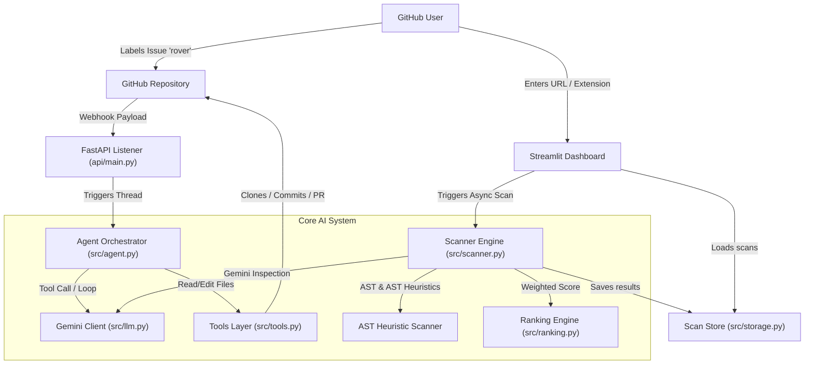
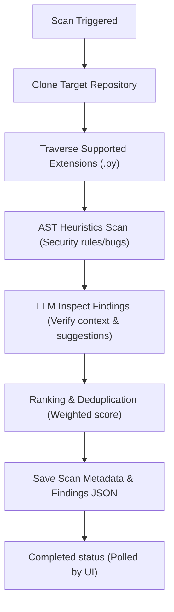
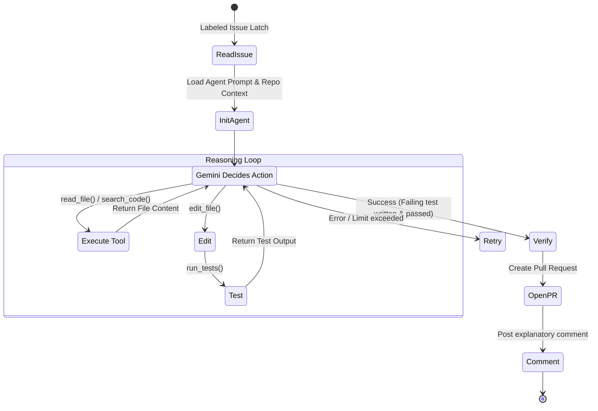
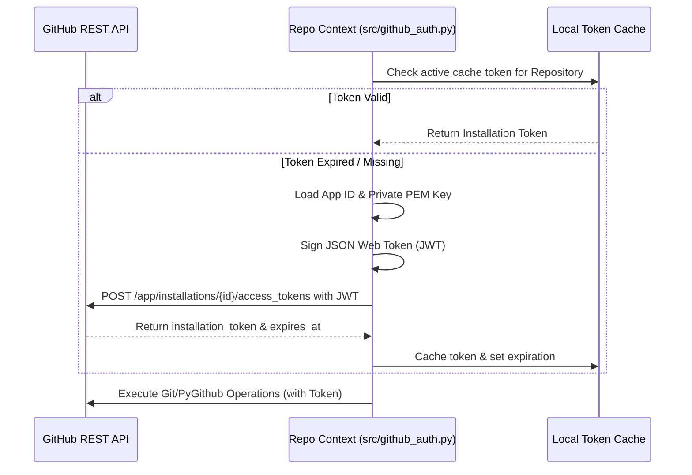
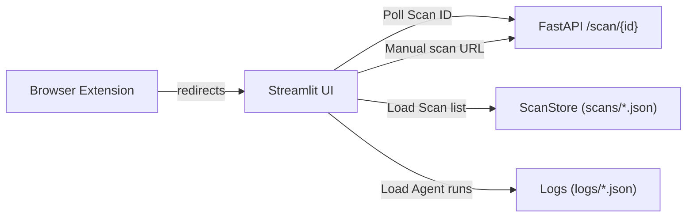
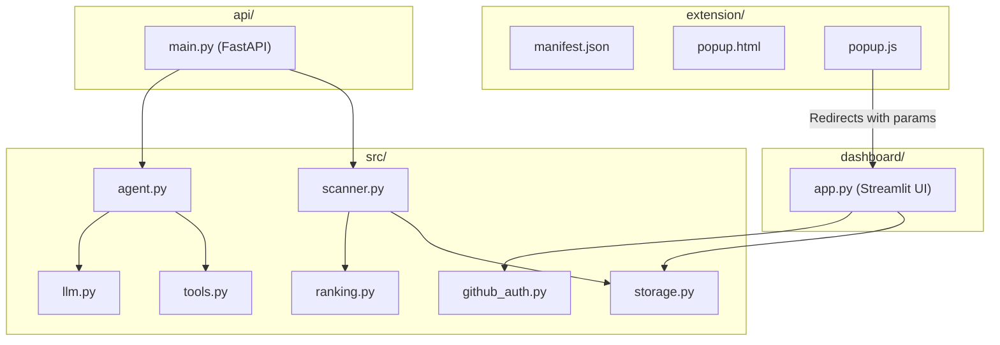

# Rover System Architecture & Diagrams

This document contains high-fidelity visual diagrams representing Rover's core components and pipelines.

---

## 1. System Architecture

Overview of how external inputs flow through Rover backend, AI layers, and output components.

---

## 2. Scan Pipeline (Proactive Discovery)

Step-by-step pipeline for repository vulnerability scanning and details storage.

---

## 3. Fix Pipeline (Reactive Fix Loop)

The tool-use execution loop of the autonomous fixing agent.

---

## 4. GitHub App Authentication Flow

Flowchart of access token exchange and caching mechanics.

---

## 5. Dashboard Flow

Interaction model of the user interface.

---

## 6. Component Diagram

Visual architecture showing folder layout relationships.

