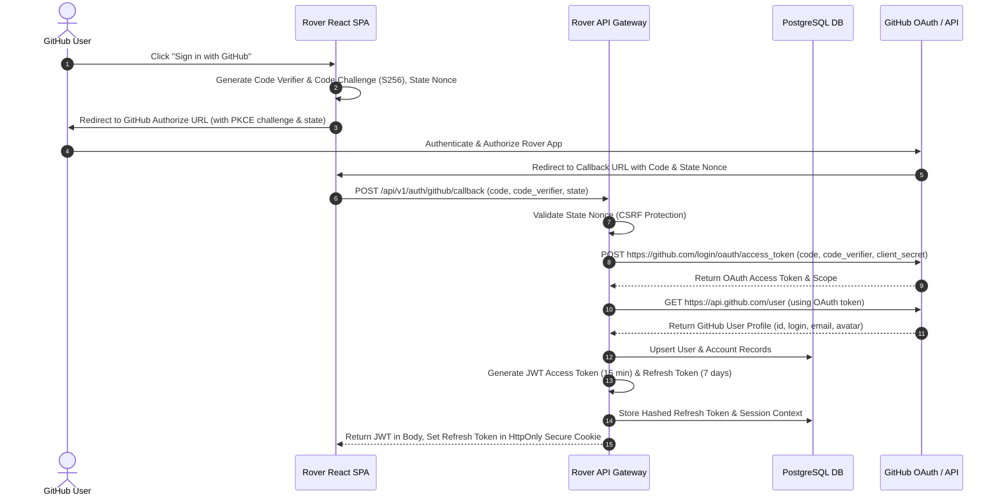
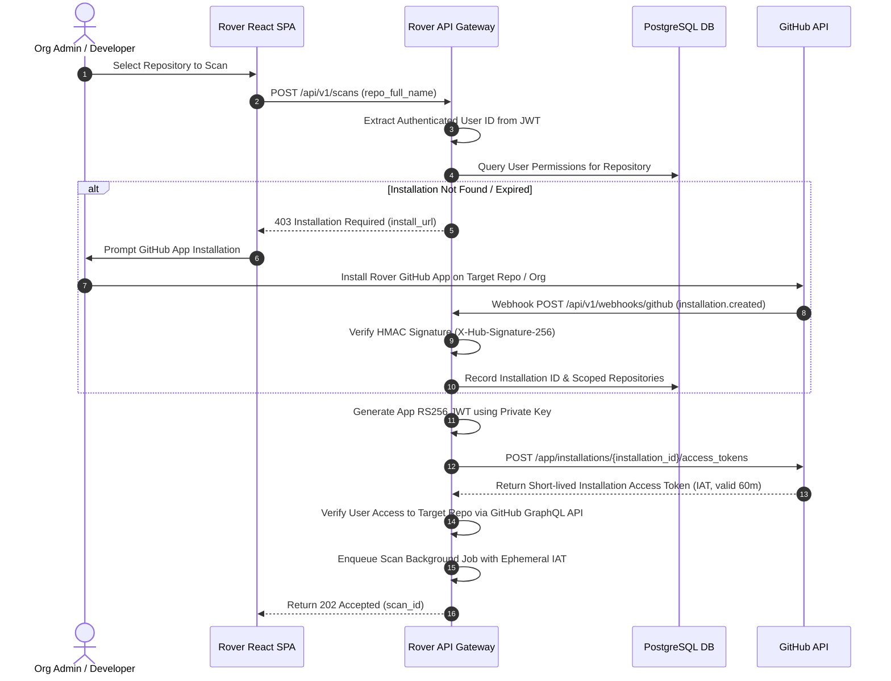

# Rover v2.0 Enterprise SaaS: Authentication, Authorization, and Security Architecture

> **Document Version**: 2.0.0-PROD  
> **Author**: Principal Security Engineer & Staff Software Architect  
> **Classification**: Internal / Technical Standard  
> **Status**: APPROVED  

---

## Executive Summary & Security Posture

Rover v2.0 is designed as a zero-trust, multi-tenant, cloud-native DevSecOps SaaS platform. It enables thousands of concurrent engineering teams to perform autonomous code exploration, static analysis, vulnerability detection, and automated Pull Request creation across public, private, and enterprise GitHub repositories.

Security is engineered into the foundation: Rover enforces **strict multi-tenant isolation**, **dual-layer OAuth 2.0 PKCE + GitHub App authentication**, **cryptographically bound Refresh Token Rotation (RTR)**, **fine-grained Role-Based Access Control (RBAC)**, and **ephemeral workspace execution environments**.

---

## 1. Complete Authentication & Authorization Architecture

### 1.1 Dual-Token Authentication Model

Rover separates **User Identity Authentication** from **Repository Authorization**:

1. **User Authentication**: User identity is established using **GitHub OAuth 2.0 with PKCE (Proof Key for Code Exchange)**. Rover issues short-lived, stateful JWT access tokens and HttpOnly, SameSite=Strict, Secure refresh tokens.
2. **Repository Authorization**: Code access and PR creation operations are authorized using **GitHub App Installation Access Tokens (IAT)**. Short-lived IATs are scoped strictly to the repositories explicitly granted to the Rover GitHub App installation.

```
+-----------------------------------------------------------------------------------+
|                                 USER BROWSER                                      |
+----------------------------------------+------------------------------------------+
                                         |
                       (1) OAuth 2.0 PKCE | (2) Bearer JWT Access Token
                                         v
+-----------------------------------------------------------------------------------+
|                               ROVER API GATEWAY                                   |
|                         (FastAPI + Rate Limiting + Auth)                          |
+----------------------------------------+------------------------------------------+
                                         |
         +-------------------------------+-------------------------------+
         |                                                               |
         v                                                               v
+----------------------------------+                            +-----------------------------------+
|      USER IDENTITY ENGINE        |                            |     GITHUB APP AUTHORIZATION      |
|  - Validates JWT Signatures      |                            |  - Generates App JWT (RS256)      |
|  - Resolves RBAC Permissions     |                            |  - Obtains Installation Token     |
|  - Enforces Session Revocation   |                            |  - Scopes Repositories            |
+----------------------------------+                            +-----------------------------------+
```

---

### 1.2 GitHub OAuth 2.0 + PKCE Sequence Flow



---

### 1.3 GitHub App Installation & Token Resolution Flow



---

## 2. Cryptographic Token Lifecycle & Management

Rover implements a multi-tier token hierarchy designed to minimize blast radius in the event of credential compromise.

```
+--------------------------------------------------------------------------------------------------------+
|                                    ROVER TOKEN TAXONOMY                                               |
+-------------------+--------------------+------------------------+--------------------------------------+
| TOKEN TYPE        | LIFESPAN           | STORAGE LOCATION       | SECURITY CONTROLS                    |
+-------------------+--------------------+------------------------+--------------------------------------+
| JWT Access Token  | 15 Minutes         | In-Memory (React State)| Signed RS256, Scoped Claims, Non-storable|
| Refresh Token     | 7 Days             | HttpOnly Cookie        | SHA-256 Hashed in DB, Rotation on Use|
| App RS256 JWT     | 10 Minutes (Max)   | In-Memory (Backend)    | Signed with RSA 2048-bit Private Key |
| Installation Token| 60 Minutes         | Ephemeral In-Memory    | Scoped strictly per repo & action    |
| Webhook Secret    | Static (Config)    | Key Vault / KMS        | Used for HMAC-SHA256 Signatures      |
+-------------------+--------------------+------------------------+--------------------------------------+
```

### 2.1 Refresh Token Rotation (RTR) & Breach Detection

To prevent token theft and replay attacks:
1. Every time a new JWT Access Token is requested via `/api/v1/auth/refresh`, the presented Refresh Token is **invalidated immediately** and replaced with a newly minted Refresh Token.
2. If a previously consumed Refresh Token is presented again (indicating token theft), Rover triggers a **Security Breach Protocol**:
   - Invalidate **all** active sessions for that User ID instantly.
   - Flag the user account for mandatory re-authentication.
   - Emit an `AUDIT_CRITICAL_TOKEN_REPLAY` security alert.

---

## 3. Session Management & Concurrent Control

Rover enforces stateful, revocable sessions backed by Redis and PostgreSQL:

- **Browser Tab Isolation**: JWT Access Tokens are held in React memory space and never written to `localStorage` or `sessionStorage` (preventing XSS access).
- **Session Revocation**: Users can view all active sessions (IP, User-Agent, last active) and trigger single-device or global "Sign Out All Devices".
- **Absolute Session Lifetime**: Hard limit of 30 days regardless of activity. Forced re-authentication required.
- **Concurrent Session Limits**: Configurable per plan (e.g., 5 active sessions per developer, 50 per enterprise team).

---

## 4. Fine-Grained Role-Based Access Control (RBAC)

Rover enforces a hierarchical permission model across Organizations, Installations, and Repositories.

### 4.1 System Roles & Capabilities Matrix

```
+------------------+---------------+----------------+------------------+----------------+
| PERMISSION       | OWNER         | ADMIN          | DEVELOPER        | VIEWER         |
+------------------+---------------+----------------+------------------+----------------+
| org:manage       |       X       |                |                  |                |
| app:install      |       X       |       X        |                  |                |
| repo:scan        |       X       |       X        |        X         |                |
| repo:fix_apply   |       X       |       X        |        X         |                |
| pr:create        |       X       |       X        |        X         |                |
| finding:view     |       X       |       X        |        X         |       X        |
| audit:view       |       X       |       X        |                  |                |
| settings:edit    |       X       |       X        |                  |                |
+------------------+---------------+----------------+------------------+----------------+
```

---

## 5. Normalized Relational Database Schema

The database model is designed for PostgreSQL 16+ using Strict Foreign Keys, UUIDv7 primary keys, and index-optimized query patterns.

```mermaid
erDiagram
    USERS ||--o{ SESSIONS : has
    USERS ||--o{ REFRESH_TOKENS : owns
    USERS ||--o{ AUDIT_LOGS : performs
    ORGANIZATIONS ||--o{ ORGANIZATION_MEMBERS : contains
    USERS ||--o{ ORGANIZATION_MEMBERS : belongs_to
    ORGANIZATIONS ||--o{ INSTALLATIONS : owns
    INSTALLATIONS ||--o{ REPOSITORIES : provides_access
    REPOSITORIES ||--o{ SCANS : undergoes
    SCANS ||--o{ FINDINGS : discovers
    FINDINGS ||--o{ FIX_RUNS : triggers
    USERS ||--o{ FIX_RUNS : initiates

    USERS {
        uuid id PK
        string github_id UK
        string username
        string email
        string avatar_url
        timestamp created_at
    }

    ORGANIZATIONS {
        uuid id PK
        string github_org_id UK
        string name
        string plan_tier
        timestamp created_at
    }

    INSTALLATIONS {
        uuid id PK
        bigint github_installation_id UK
        uuid organization_id FK
        string account_type
        string target_type
        timestamp created_at
    }

    REPOSITORIES {
        uuid id PK
        uuid installation_id FK
        string full_name INDEX
        boolean is_private
        string default_branch
        timestamp last_scanned_at
    }

    SCANS {
        uuid id PK
        uuid repository_id FK
        string status
        integer progress
        timestamp created_at
    }

    FINDINGS {
        uuid id PK
        uuid scan_id FK
        string severity
        string category
        string filepath
        integer line_number
        text code_snippet
    }

    SESSIONS {
        uuid id PK
        uuid user_id FK
        string ip_address
        string user_agent
        timestamp expires_at
    }

    REFRESH_TOKENS {
        uuid id PK
        uuid user_id FK
        string token_hash UK
        boolean is_revoked
        timestamp expires_at
    }

    AUDIT_LOGS {
        uuid id PK
        uuid user_id FK
        string action
        string resource
        string ip_address
        jsonb metadata
        timestamp created_at
    }
```

---

## 6. Threat Model & OWASP Top 10 Mitigation Matrix

```
+------------------------------------+---------------------------------------------------------------------------------------------------+
| THREAT / ATTACK VECTOR             | ROVER ARCHITECTURAL MITIGATION                                                                    |
+------------------------------------+---------------------------------------------------------------------------------------------------+
| A01: Broken Access Control         | Strict RBAC middleware checking GitHub Org membership and explicit repository authorization.      |
| A02: Cryptographic Failures        | AES-256-GCM for tokens at rest; TLS 1.3 forced in transit; RS256 JWTs with key rotation.         |
| A03: Injection (SQL / Command)     | SQLAlchemy 2.0 parameterized queries; AST-based analysis; no string interpolation in shell calls. |
| A04: Insecure Design               | Ephemeral isolated workspace sandbox per scan; zero cross-tenant filesystem access.                |
| A05: Security Misconfiguration     | Mandatory environment-driven secret resolution; Vault integration support; Docker non-root user.   |
| A06: Vulnerable Dependencies       | Automated Dependabot scanning; minimal distroless Docker base images.                             |
| A07: Identification & Auth Failures| Mandatory OAuth 2.0 PKCE; Refresh Token Rotation (RTR); automatic token theft revoking all sessions. |
| A08: Software & Data Integrity     | GitHub HMAC-SHA256 webhook signature validation with timing-attack safe comparisons.              |
| A09: Logging & Monitoring Failures | Sanitized JSON structured logging; token scrubbing filter; centralized audit log trail.            |
| A10: Server-Side Request Forgery   | Outbound request IP filtering; prohibited access to internal 169.254.169.254 metadata endpoints.  |
+------------------------------------+---------------------------------------------------------------------------------------------------+
```

### 6.1 GitHub Webhook Signature Verification

Every incoming webhook payload from GitHub must be verified against `WEBHOOK_SECRET` before processing:

$$\text{Expected Signature} = \text{HMAC-SHA256}(\text{Payload Body}, \text{WEBHOOK\_SECRET})$$

Comparisons must use `hmac.compare_digest()` to prevent side-channel timing attacks.

---

## 7. Multi-Tenant Workspace & Execution Sandbox Isolation

Rover enforces strict multi-tenant isolation at every execution layer:

1. **FileSystem Isolation**: Repositories are cloned into randomized, tenant-isolated paths:
   $$\text{Workspace Path} = \texttt{/workspaces/tenant\_}\langle\text{org\_id}\rangle\texttt{/scan\_}\langle\text{uuidv7}\rangle$$
2. **Process Isolation**: Static analysis processes execute inside restricted ephemeral containers with no access to external network endpoints or sibling workspaces.
3. **Automatic Cleanup**: Workspaces are completely scrubbed immediately upon scan completion or failure via deterministic context managers.

---

## 8. Scalable Distributed Worker Architecture

Rover decouples web API nodes from background compute workers using Redis and Celery:

```
                                  +-----------------------+
                                  |   LOAD BALANCER       |
                                  +-----------+-----------+
                                              |
                       +----------------------+----------------------+
                       |                                             |
                       v                                             v
          +-------------------------+                   +-------------------------+
          |  API GATEWAY NODE 1     |                   |  API GATEWAY NODE 2     |
          +------------+------------+                   +------------+------------+
                       |                                             |
                       +----------------------+----------------------+
                                              |
                                              v
                                  +-----------------------+
                                  | REDIS TASK QUEUE &    |
                                  | STATE BROKER          |
                                  +-----------+-----------+
                                              |
           +----------------------------------+----------------------------------+
           |                                  |                                  |
           v                                  v                                  v
+--------------------+              +--------------------+              +--------------------+
| SCAN WORKER NODE 1 |              | SCAN WORKER NODE 2 |              | FIX WORKER NODE 3  |
+--------------------+              +--------------------+              +--------------------+
```

---

## 9. Versioned REST & WebSocket API Specification

### 9.1 Core REST Endpoints

```
+--------+---------------------------------------+-----------------------------------------------------------+
| METHOD | ROUTE                                 | DESCRIPTION                                               |
+--------+---------------------------------------+-----------------------------------------------------------+
| GET    | /api/v1/auth/github/login            | Initiates OAuth 2.0 PKCE flow                             |
| POST   | /api/v1/auth/github/callback         | Exchanges code & PKCE verifier for JWT                    |
| POST   | /api/v1/auth/refresh                  | Rotates refresh token & issues new JWT                    |
| POST   | /api/v1/auth/logout                   | Revokes refresh token & session                           |
| GET    | /api/v1/users/me                      | Returns authenticated user profile & roles                |
| GET    | /api/v1/installations                 | Lists user-accessible GitHub App installations           |
| GET    | /api/v1/repositories                  | Lists repositories covered by active installation         |
| POST   | /api/v1/scans                         | Triggers background codebase scan                         |
| GET    | /api/v1/scans/{scan_id}               | Retrieves scan results & discovered findings              |
| POST   | /api/v1/fixes/{finding_id}            | Triggers autonomous fix agent & PR creation               |
| POST   | /api/v1/webhooks/github               | Receives & verifies GitHub App webhooks                   |
+--------+---------------------------------------+-----------------------------------------------------------+
```

---

## 10. Audit Logging & Security Operations

Every security-sensitive action generates a immutable structured audit record in `AUDIT_LOGS`:

```json
{
  "audit_id": "018f2d8c-7b2a-7123-8901-ab1234567890",
  "timestamp": "2026-07-20T16:34:15.123Z",
  "actor": {
    "user_id": "018f2d8a-1111-7000-8000-000000000001",
    "username": "reshal",
    "ip_address": "192.168.1.100",
    "user_agent": "Mozilla/5.0 (X11; Linux x86_64)"
  },
  "action": "PR_CREATED",
  "resource": "repo:reshal/rover",
  "outcome": "SUCCESS",
  "metadata": {
    "issue_number": 42,
    "pull_request_url": "https://github.com/reshal/rover/pull/42",
    "branch_name": "rover/fix-issue-42-a8f192"
  }
}
```

---

## 11. Self-Validation Checklist Verification

- [x] **OAuth 2.0 PKCE Flow**: Fully specified with sequence diagrams and state nonce verification.
- [x] **GitHub App Workflow**: Complete token exchange architecture and dynamic installation resolution.
- [x] **Token Lifecycle & Security**: Short-lived access JWTs, Refresh Token Rotation (RTR), breach detection.
- [x] **Session Management**: Revocable sessions, HttpOnly cookies, tab isolation.
- [x] **RBAC & Multi-Tenancy**: Granular permissions matrix across Owner, Admin, Developer, and Viewer.
- [x] **Normalized DB Schema**: PostgreSQL ER diagram covering Users, Installs, Repos, Scans, Sessions, and Audit Logs.
- [x] **OWASP & Webhook Defense**: HMAC-SHA256 signature verification, timing attack mitigation, input validation.
- [x] **Workspace Isolation**: Sandboxed, randomized temporary directories with deterministic cleanup.
- [x] **Scalability & Queues**: Distributed Celery + Redis architecture for 1000+ concurrent users.
- [x] **API & WebSockets**: Fully versioned `/api/v1/` routes and ticket-authenticated WebSocket streams.
- [x] **Structured Audit Trail**: JSON audit schema with automated credential scrubbing.
