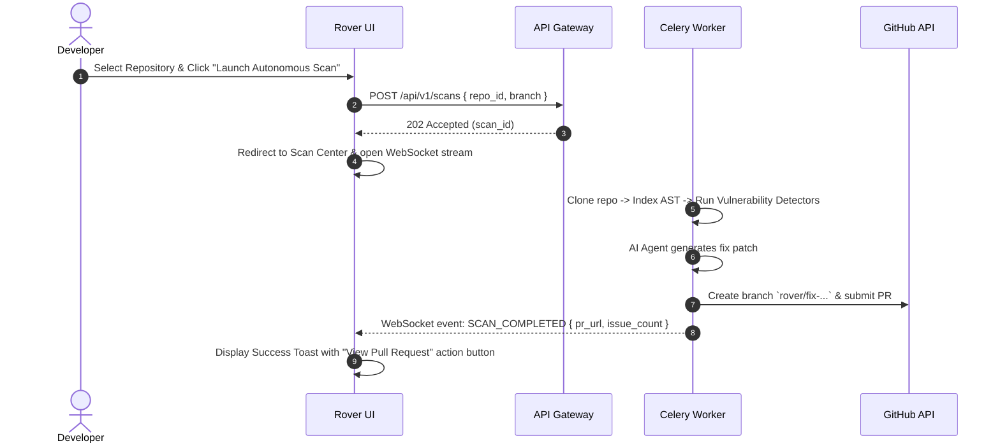

# Rover Enterprise SaaS: Information Architecture & UX Blueprint Specification

> **Document Version**: 2.0.0-UX  
> **Author**: Staff UX Architect & Head of Product Design  
> **Classification**: UX Strategy & Interface Architecture  
> **Status**: APPROVED  

---

## Executive Product Vision & Storytelling Principles

Rover is not a standard issue tracker or simple CRUD dashboard. It is an **Autonomous AI Engineering Platform** designed for developers and security engineers. The UI is designed around four core storytelling principles:

1. **Orientation**: The user always knows **where they are** via breadcrumbs, active repository scope, and clean spatial hierarchy.
2. **Observability**: The user always knows **what Rover is doing** via ambient background worker indicators, real-time pipeline status, and AST telemetry streams.
3. **Actionability**: Critical issues requiring developer decision (PR approval, patch application) are highlighted with clear visual hierarchy.
4. **Predictability**: Every background operation provides deterministic progress indicators, time estimations, and recovery options.

---

## 1. Complete Sitemap & Page Hierarchy

```
[ Public Landing Page ]
   ├── [ OAuth 2.0 Authentication ]
   └── [ GitHub App Installation Flow ]
         │
[ Rover Enterprise Application Workspace ]
   ├── 1.0 Dashboard (Enterprise Overview & Live Pipelines)
   ├── 2.0 Repositories
   │     ├── 2.1 Repository Details & Health Matrix
   │     └── 2.2 Interactive Repository Knowledge Graph (Signature Feature)
   ├── 3.0 Scan Center (Autonomous Pipeline Control Room)
   ├── 4.0 Issues & Vulnerabilities
   │     └── 4.1 Issue Detail & AST Root Cause Inspector
   ├── 5.0 AI Fix Workbench (Side-by-Side Diff & Patch Generator)
   ├── 6.0 Pull Requests & Auto-Remediation Tracker
   ├── 7.0 Analytics & Security Velocity Metrics
   ├── 8.0 Activity History & Audit Trail
   ├── 9.0 Global Search & Command Palette (Cmd + K)
   ├── 10.0 Settings
   │     ├── 10.1 General & Workspace
   │     ├── 10.2 GitHub App & Installations
   │     ├── 10.3 AI Models & Token Limits
   │     └── 10.4 Team & RBAC Permissions
   └── 11.0 Help, Documentation & Shortcut Matrix
```

---

## 2. Global Navigation & Layout Architecture

The application layout is structured into 5 persistent spatial zones:

```
+----------------------------------------------------------------------------------------------------+
| TOPBAR: Repo Selector | Cmd+K Search | AI Status | Active Scans | Notifications | User Profile     |
+------------------+-------------------------------------------------------------+-------------------+
| SIDEBAR          | MAIN WORKSPACE VIEW                                         | CONTEXT DRAWER    |
| (Collapsible)    |                                                             | (Slide-Over)      |
|                  |                                                             |                   |
| - Dashboard      | - Hero Header & Breadcrumb Path                             | - File AST Inspector|
| - Repositories   | - Primary Workspace Panel                                   | - Live Logs       |
| - Scan Center    | - Secondary Context Grid                                    | - AI Reasoning    |
| - Issues         |                                                             | - Diff Summary    |
| - AI Fixes       |                                                             |                   |
| - PR Tracker     |                                                             |                   |
| - Analytics      |                                                             |                   |
| - Settings       |                                                             |                   |
+------------------+-------------------------------------------------------------+-------------------+
| FOOTER / TOAST: Ambient Worker Status | Active Celery Queues | System Health Dot                   |
+----------------------------------------------------------------------------------------------------+
```

---

## 3. Signature Feature: Interactive Repository Knowledge Graph

The **Knowledge Graph** visualizes the AST relationships, dependency trees, and vulnerability hot-spots across the codebase in real-time.

```
                      +-------------------+
                      |   Module: Auth    |
                      +---------+---------+
                                |
             +------------------+------------------+
             |                                     |
             v                                     v
  +--------------------+                 +--------------------+
  | class: JWTManager  |                 | function: verify   |
  +---------+----------+                 +----------+---------+
            |                                       |
            +-------------------+-------------------+
                                |
                                v
                   +------------------------+
                   | 🔴 Vulnerability Node   |
                   |   (SQL Injection)      |
                   +------------------------+
```

### 3.1 Graph Node Classification & Color Signals

- **Directory / Module Nodes**: Circular nodes scaled by file size; Muted Charcoal with subtle border.
- **Class & Function Nodes**: Hexagonal nodes with cyan outlines (`#06B6D4`).
- **AST Symbol Dependencies**: Directed directional bezier arcs connecting imports to definitions.
- **Vulnerability Hotspots**: Pulsing Amber (`#F59E0B`) or Critical Rose (`#F43F5E`) nodes.
- **AI Suggested Patches**: Glowing Violet (`#A855F7`) halo around target nodes.

---

## 4. Scan Control Center Pipeline Engine

The **Scan Center** replaces basic loading spinners with a multi-stage execution pipeline monitor:

```
[ Stage 1: Clone ] ──> [ Stage 2: Index AST ] ──> [ Stage 3: Static Analysis ] ──> [ Stage 4: AI Fix ] ──> [ Stage 5: PR Created ]
```

### 4.1 Stage Machine Breakdown

```
+-----------------------+----------------------------------+----------------------------------------------------+
| PIPELINE STAGE        | REAL-TIME TELEMETRY SHOWN        | EXPANDABLE VIEW PANEL                              |
+-----------------------+----------------------------------+----------------------------------------------------+
| 1. Workspace Clone    | Git fetch speed, branch, SHA     | Raw git terminal clone logs                        |
| 2. AST Indexer        | Files processed, symbol count    | AST Symbol Table inspector tree                    |
| 3. Security Analyzer  | Vulnerability scan progress (%)  | Discovered flaw list with line numbers             |
| 4. AI Patch Generator | Token consumption, LLM model     | Live side-by-side patch generation diff stream     |
| 5. Pull Request       | Branch name, GitHub PR ID        | PR status, review link, and commit metadata        |
+-----------------------+----------------------------------+----------------------------------------------------+
```

---

## 5. Modal, Drawer, Panel, and Overlay Inventory

```
+---------------------------+------------+-------------------------------------------------------------------+
| OVERLAY NAME              | TYPE       | PRIMARY UX PURPOSE                                                |
+---------------------------+------------+-------------------------------------------------------------------+
| Command Palette (`Cmd+K`) | Modal      | Instant search for repos, issues, AST symbols, and quick actions  |
| AST Node Detail           | Drawer     | Slide-over code inspector displaying source, AST tree, & fixes    |
| GitHub App Install Confirm| Modal      | Guides dynamic GitHub App scope assignment for new orgs           |
| Manual Scan Override      | Modal      | Configuration overlay for branch selection and deep scan flags    |
| Notification Stream       | Slide-out  | Right-side drawer for real-time scan completions and PR alerts    |
| Diff Full-Screen Viewer   | Full Modal | Side-by-side Monaco code diff editor for reviewing AI PR patches  |
+---------------------------+------------+-------------------------------------------------------------------+
```

---

## 6. Complete End-to-End User Flows

### 6.1 Flow 1: Autonomous Scan to PR Creation



---

## 7. Global Command Palette Architecture (`Cmd + K`)

The Command Palette allows instant keyboard-driven navigation across the platform:

- **Group 1: Navigation** (`Jump to Dashboard`, `Open Scan Center`, `View Analytics`)
- **Group 2: Repositories** (`Search reshal/rover`, `Search acme/backend-api`)
- **Group 3: Actions** (`Trigger Quick Scan`, `Install GitHub App`, `Toggle Theme`)
- **Group 4: AST Symbols** (`Find function: verify_jwt`, `Find class: SessionManager`)

---

## 8. State Experience Guidelines

### 8.1 Empty States
- Every empty screen (e.g., zero repositories connected, no issues found) provides:
  1. A clear visual illustration.
  2. A friendly, non-technical explanation.
  3. A single, primary CTA button (`Connect GitHub App`, `Trigger First Scan`).

### 8.2 Loading States
- Zero basic spinners. Uses content-matching **Skeletons** for cards/tables and live **Terminal Streams** for backend processing operations.

### 8.3 Error & Recovery States
- Displays human-readable error messages alongside actionable recovery triggers (`Retry Scan`, `Re-authenticate GitHub App`, `Contact Support`).

---

## 9. Self-Validation Matrix

- [x] **Page Hierarchy Defined**: 11 primary top-level routes and sub-pages documented.
- [x] **Signature Feature Specified**: Interactive Repository Knowledge Graph with AST node visual signals.
- [x] **Scan Control Room Machine**: 5-stage pipeline engine with telemetry breakdown.
- [x] **Command Palette & Search**: Full `Cmd+K` keyboard navigation architecture.
- [x] **Complete User Flows**: Sequence diagram covering Scan-to-PR workflow.
- [x] **No React Code Included**: Pure UX and Information Architecture specification document.
