# Rover Enterprise SaaS: Motion Design, Three.js WebGL & Animation Architecture

> **Document Version**: 2.0.0-MOTION  
> **Author**: Principal Motion Designer, Creative Director & Three.js Engineer  
> **Classification**: Motion System & WebGL Technical Standard  
> **Status**: APPROVED  

---

## Executive Motion Philosophy & Choreography

Rover is not static; it is **alive, fluid, and continuously thinking**. Every motion is intentional—designed to communicate system state, background compute progress, and security context rather than idle decoration.

The motion language is inspired by **Apple VisionOS, Arc Browser, Raycast, and Linear**:

```
[ Ambient 3D Depth ] ──> [ Decelerated Spring Physics ] ──> [ State-Driven Choreography ]
```

1. **Spatial Depth**: Interfaces exist on floating z-layers above an ambient, reactive 3D WebGL canvas.
2. **Decelerated Springs**: Natural motion curves with zero abrupt starts or stops.
3. **Intentional Feedback**: Micro-interactions react instantly (< 150ms) to confirm user input.

---

## 1. Three.js / React Three Fiber Ambient Canvas Architecture

Rover features a continuous, GPU-accelerated background scene rendering an ambient **AST Constellation & Neural Network Graph**.

```
+----------------------------------------------------------------------------------------------------+
|                                  THREE.JS AMBIENT SCENE GRAPH                                      |
+----------------------------------------------------------------------------------------------------+
| Perspective Camera (FOV: 45, Near: 0.1, Far: 1000) with Subtle Parallax Drift                      |
|                                                                                                    |
|  [ Layer 1: Ambient Lighting ]                                                                     |
|    ├── DirectionalLight (Color: #6366F1, Intensity: 0.8)                                          |
|    ├── PointLight (Color: #06B6D4, Position: [10, 10, -10])                                       |
|    └── AmbientLight (Color: #0B0F19, Intensity: 0.4)                                              |
|                                                                                                    |
|  [ Layer 2: Instanced Mesh Particles ]                                                             |
|    └── InstancedBufferGeometry (500 Nodes representing AST symbols)                               |
|          ├── Vertex Shader: Noise-based continuous orbital floating                                 |
|          └── Fragment Shader: Distance-based alpha falloff & subtle cyan glow                       |
|                                                                                                    |
|  [ Layer 3: Dynamic Bezier Edge Connections ]                                                     |
|    └── LineSegments2 (Dynamic connections between active scanning nodes)                          |
|                                                                                                    |
|  [ Layer 4: Volumetric Depth Fog ]                                                                 |
|    └── FogExp2 (Color: #080C14, Density: 0.025)                                                   |
+----------------------------------------------------------------------------------------------------+
```

### 1.1 Mouse Parallax & Inertial Camera Drift

The camera position updates on every render frame using lerp (linear interpolation) to mirror the user's cursor:

$$\text{Camera}_x = \text{Camera}_x + (\text{Mouse}_x \times 0.5 - \text{Camera}_x) \times 0.05$$
$$\text{Camera}_y = \text{Camera}_y + (-\text{Mouse}_y \times 0.5 - \text{Camera}_y) \times 0.05$$

---

## 2. Framer Motion Component Orchestration Strategy

Framer Motion manages layout transitions, page mounts, modals, and micro-interactions.

### 2.1 Standardized Motion Spring Tokens

```json
{
  "transitions": {
    "subtle_spring": { "type": "spring", "stiffness": 300, "damping": 30, "mass": 0.8 },
    "bouncy_spring": { "type": "spring", "stiffness": 400, "damping": 25, "mass": 0.6 },
    "smooth_decelerate": { "duration": 0.22, "ease": [0.16, 1, 0.3, 1] },
    "fast_out": { "duration": 0.15, "ease": [0.4, 0, 1, 1] }
  }
}
```

### 2.2 Shared Layout Page Transitions

```
[ View A Unmounts ] ──> (Scale 1.0 -> 0.98, Opacity 1 -> 0, 150ms)
                                │
[ View B Mounts ]   ──> (Scale 1.02 -> 1.0, Opacity 0 -> 1, 220ms decelerate spring)
```

---

## 3. GSAP Timeline Strategy for Scan Center Sequences

The **Scan Center Control Room** uses **GSAP Timelines** to choreograph multi-stage scan animations deterministically:

```mermaid
gantt
    title Scan Control Room Cinematic Animation Sequence
    dateFormat  ss
    axisFormat %S
    stage1 :active, clone, 00, 03s
    stage2 :index, 02, 06s
    stage3 :scan, 05, 09s
    stage4 :ai_fix, 08, 12s
    stage5 :pr, 11, 14s
```



1. **Stage 1 (Clone)**: Repository node spawns at center; folder meshes expand outward.
2. **Stage 2 (AST Index)**: Laser pulse sweeps across nodes, lighting up symbol instances.
3. **Stage 3 (Security Scan)**: Vulnerable nodes turn Amber/Rose and emit a high-frequency radial ripple.
4. **Stage 4 (AI Fix Generation)**: Violet particle stream flows from the AI reasoning engine directly into the vulnerable node, transforming it into a passing Green state.
5. **Stage 5 (PR Creation)**: A new branch line splits from the main trunk and connects directly to the GitHub PR icon.

---

## 4. Micro-Interaction & Component Motion Matrix

```
+-------------------+----------------------------------+----------------------------------------------------+
| COMPONENT         | EVENT / TRIGGER                  | MOTION BEHAVIOR & ANIMATION SPEC                   |
+-------------------+----------------------------------+----------------------------------------------------+
| Floating Card     | Cursor Hover                     | 3D Tilt (max 6deg rotateX/Y), 2px lift, shadow glow|
| Primary Button    | Click / Pointer Down             | Scale 0.96 with spring dampening, subtle haptic pulse|
| Number Counter    | Data Load / Update               | Numeric count-up interpolation over 600ms (easeOut)|
| Live Terminal     | Streaming Log Input              | Auto-scroll with smooth spring momentum inertia    |
| Modal Overlay     | Open Trigger                     | Backdrop blur 0->12px, window scale-in (0.95->1.0) |
| Drawer Panel      | Slide In                         | Right slide (x: 100%->0%) with decelerated spring  |
| Toast Alert       | Spawn                            | Slide-up from bottom right (y: 20px->0px, fade in) |
| AST Node          | Click Selection                  | Camera focus zoom (Z: 15->5), node glow intensifies|
+-------------------+----------------------------------+----------------------------------------------------+
```

---

## 5. 60 FPS Performance Optimization & WebGL Lifecycle

To guarantee 60 FPS across desktop and mobile devices:

1. **GPU Instancing**: All 3D nodes use `InstancedMesh` (a single draw call handles 500+ AST nodes).
2. **Frustum Culling**: Nodes outside the active camera frustum are instantly skipped in render loops.
3. **Framerate Throttling**: The WebGL render loop automatically pauses (`cancelAnimationFrame`) when the user switches browser tabs (`document.hidden`).
4. **Resolution Scaling**: Rendering resolution dynamically scales down to `0.75x` on high-DPI displays if frame times drop below 16.6ms.

---

## 6. Accessibility & Reduced Motion Protocol

Rover respects system accessibility preferences at all times:

```javascript
// Motion Safety Abstraction Rule
if (window.matchMedia('(prefers-reduced-motion: reduce)').matches) {
  // 1. Disable 3D WebGL camera rotation & particle motion
  // 2. Replace all Framer Motion scale/translate transitions with pure opacity cross-fades
  // 3. Pause all continuous particle ambient loops
}
```

---

## 7. Frontend Motion Implementation Roadmap

```
Phase 1: Motion Token System & Framer Motion Setup
   ├── Define spring physics curves in Tailwind / CSS Variables
   └── Implement Base Motion Component wrappers (Fade, Slide, Scale)

Phase 2: R3F Ambient Canvas Setup
   ├── Construct WebGL Canvas, Instanced Nodes, and Fog shaders
   └── Add mouse parallax lerp camera tracking

Phase 3: Interactive Component Motion
   ├── 3D Tilt Card implementation
   ├── Micro-interactions (Buttons, Badges, Modals, Drawers)
   └── Number counter & Sparkline path draw animations

Phase 4: GSAP Cinematic Scan Engine
   ├── Build multi-stage Scan Control Room timeline
   └── Integrate real-time WebSocket state triggers with GSAP timelines
```

---

## 8. Self-Validation Matrix

- [x] **Continuous 3D Ambient Scene**: Defined Three.js R3F scene graph with instanced nodes and parallax.
- [x] **Page & Layout Transitions**: Framer Motion shared layout springs and decelerated exit/entry curves.
- [x] **Cinematic Scan Engine**: GSAP timelines for 5-stage repository scan and PR creation workflow.
- [x] **Micro-Interaction Matrix**: Defined 3D card tilt, magnetic hover, modal springs, and streaming terminals.
- [x] **60 FPS Performance Architecture**: Instanced rendering, frustum culling, and resolution scaling.
- [x] **Accessibility Verified**: Automatic `prefers-reduced-motion` detection and opacity fallback rules.
- [x] **No React Code Included**: Pure architectural motion specification document.
